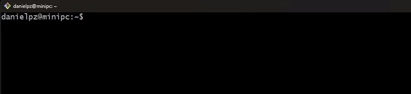
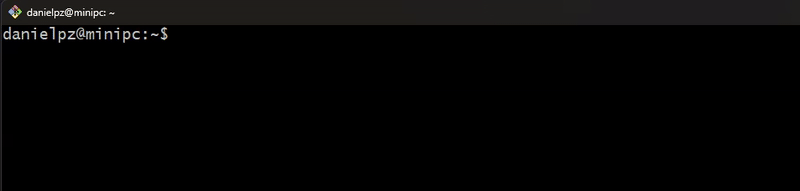

<div align="center">
    <p>
        <h1>⬇️ Mediafire DL</h1>
    </p>
    <p>
        <a href="README.md"> Ingles</a> — <a href="README-es_ES.md"> Español</a>
    </p>
</div>

Un programa de terminal simple pero muy útil para descargar archivos y carpetas de mediafire.com, construido con Typescript, Deno y música, disfrutando de la ingeniería inversa.

> 🔔 Actualización 0.4.0 super importante: Se refactorizó la manera en que se manejan las descargas para evitar un posible archivo corrupto al descargar archivos comprimidos. Actualizar porfa

## 📸 Vista previa


## 🔧 Instalación

Solo tienes que ir a la [página de lanzamiento](https://github.com/dapize/mediafiredl/releases) para obtener el binario correcto. Los sistemas operativos compatibles son: Linux, Windows (Intel y ARM), Mac (Intel y ARM). Es portable

```bash
## Ejemplo de una instalación en linux
wget -c https://github.com/dapize/mediafiredl/releases/download/v0.4.0/mediafiredl_linux -O mediafiredl
chmod +x ./mediafiredl
```

## ✨ Uso

```
Uso: mediafiredl [opciones] [links...]

Descarga archivos y carpetas de Mediafire

Argumentos:
  links                         Enlaces de archivos o carpetas de Mediafire

Optiones:
  -V, --version                 Muestra el número de versión
  -o, --output <path>           Directorio de salida (predeterminado: directorio actual) (predeterminado: "./")
  -m, --max-downloads <number>  Descargas simultáneas máximas (predeterminado: "2")
  -i, --input-file <path>       Ruta a un archivo de texto que contiene enlaces de Mediafire
  -d, --details                 Habilitar salida detallada (modo detallado) (predeterminado: false)
  --inspect                     Obtiene información detallada sobre el enlace proporcionado sin descargar el archivo. (predeterminado: false)
  -H, --headers-file <path>     Ruta al archivo de encabezados HTTP personalizados (formato raw o JSON)
  --export-default-headers <path>  Exportar encabezados predeterminados a un archivo (predeterminado: ./headers.txt)
  -B, --buffer-size <number>    Tamaño del buffer en RAM para las descargas (en megabytes) (default: "64")
  --beautify                    Devuelve con un formato embellecedor los datos a mostrar para la opción 'inspect'. (predeterminado: false)
  -h, --help                    Mostrar ayuda
```

**¡Y listo!** Eso es todo lo que necesitas para usar **mediafiredl**.

## 📌 Ejemplos

#### Descarga por carpeta



#### Descarga desde un archivo de texto (un enlace por línea)



#### Descarga con más detalles


## 📦️ Compila tu propio MediafireDL

Primero, [clona el repo de MediafireDL](https://docs.github.com/es/repositories/creating-and-managing-repositories/cloning-a-repository). Luego, ingresa al directorio mediafiredl, instala las dependencias y ejecuta el comando de compilación:
> Obviamente tienes que tener [Deno](https://deno.com/) instalado en tu sistema primero.

```bash
cd mediafiredl
deno install
deno run build
```

La versión compilada de MediafireDL estará en la carpeta `bin/`.

## 💡 Contribuyendo

1. Haz un fork al proyecto.
2. Crea una rama para la nueva característica.
3. Escribe la nueva característica.
4. Escribe la prueba unitaria.
5. Envía una solicitud de incorporación de cambios.

## 💖 Donar

Si crees que este software es útil y te ahorra mucho trabajo, muchos costes y te permite dormir mucho mejor, entonces donar una pequeña cantidad sería genial.

<a href="https://www.buymeacoffee.com/danielpz" target="_blank"></a>

## 📫 Informes de errores y solicitudes de funciones

Puedes ayudar informando errores, sugiriendo funciones, revisando especificaciones de funciones o simplemente compartiendo tu opinión. Usa [GitHub Issues](https://github.com/dapize/mediafiredl/issues) para todo eso. ¡Todas las solicitudes de incorporación de cambios son bienvenidas!

## 🧾 License

El código y la documentación se publican bajo la [licencia MIT](LICENSE).
