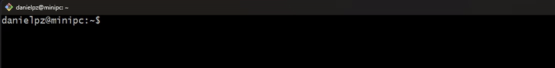
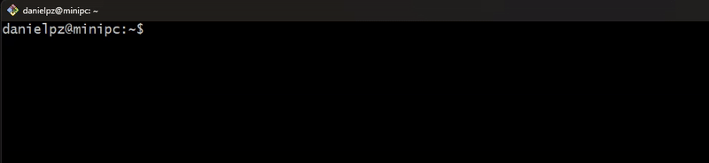
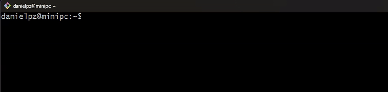
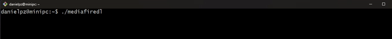

<div align="center">
    <p>
        <h1>⬇️ Mediafire DL</h1>
    </p>
    <p>
        <a href="README.md"> English</a> — <a href="README-es_ES.md"> Spanish</a>
    </p>
</div>

A simple but very useful terminal software to download files from mediafire.com (files and folders).

## 📸 Preview



## ✨ Usage

```bash
Usage: mediafiredl [options] [links...]

Download files and folders from MediaFire

Argumentos:
  links                         Links Links to MediaFire files or folders

Optiones:
  -V, --version                 Display version number
  -o, --output <path>           Output directory (default: current directory) (default: "./")
  -m, --max-downloads <number>  Maximum simultaneous downloads (default: "2")
  -i, --input-file <path>       Path to a text file containing MediaFire links
  -d, --details                 Enable verbose output (verbose mode) (default: false)
  --inspect                     Get detailed information about the given link without downloading the file. (default: false)
  --beautify                    Returns beautified data to display for the 'inspect' option. (default: false)
  -h, --help                    Show help
```

## 🔧 Installation

Just you have to go to the [Release Page](https://github.com/dapize/mediafiredl/releases) to get the correct binary. Supported operating systems are: Linux, Windows (Intel and ARM), Mac (Intel and ARM)

```bash
## Example for Linux installation
wget -c https://github.com/dapize/mediafiredl/releases/download/v0.3.1/mediafiredl_linux -O mediafiredl
chmod +x ./mediafiredl
```

**And voila!** That's all you need to use the **mediafiredl**.

## 📌 Examples

#### Download folders



#### Download from TXT file (one link per line)



#### Download with more details



## 💡 Contributing

1. Fork the project.
2. Create a branch for your new feature.
3. Write the new feature.
4. Write the unit test.
5. Submit a pull request.

## 💖 Donate

If you think this software is useful and saves you a lot of work, a lot of costs and let you sleep much better, then donating a small amount would be very cool.

<a href="https://www.buymeacoffee.com/danielpz" target="_blank"></a>

## 📫 Bug Reports & Feature Requests

You can help by reporting bugs, suggesting features, reviewing feature specifications or just by sharing your opinion. Use [GitHub Issues](https://github.com/dapize/mediafiredl/issues) for all of that. All pull requests are welcome !

## 🧾 License

The code and documentation are published under the [Mit License](LICENSE).
