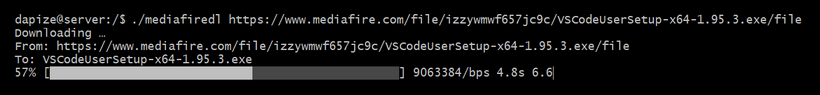

# Mediafire DL



Is a simple sofware for download files from mediafire.com by terminal.

## Usage

### via Command Line

```bash
$ mediafiredl --help
usage: mediafiredl [-h] [-v] [-o OUTPUT] [-i TEXTFILE] [--output-dir] url
```

## License

MIT
